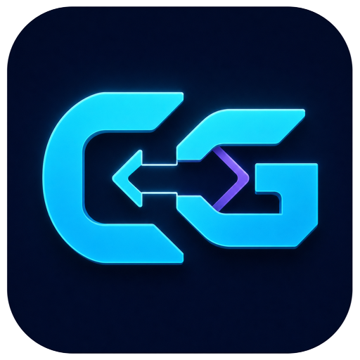

<p align="center">
  
</p>

# CC Gateway

CC Gateway is a focused desktop manager and local protocol gateway for Claude Code, Claude Desktop, and agent backends. Configure one Anthropic-compatible upstream profile—AnyRouter by default—and reuse it through one Rust listener without copying the upstream key into each client.

> **v0.1.0 is an unsigned pre-release.** It targets macOS Universal and Windows x64. macOS Gatekeeper or Windows SmartScreen may require manual confirmation.

[简体中文](README_ZH.md) · [日本語](README_JA.md) · [Deutsch](README_DE.md)

## What it does

- Stores one canonical connection profile: base URL, Bearer/API-key authentication, upstream credential, and model catalog.
- Routes Claude Code and Claude Desktop through the same local listener at `127.0.0.1:15722`.
- Exposes local Anthropic Messages, OpenAI Responses, and Chat Completions endpoints for user-managed agents.
- Gives every local consumer a separate gateway key. The upstream key is never returned to local clients.
- Tests the upstream with a real minimal Messages request and can verify every catalog model individually.
- Keeps only redacted in-memory diagnostics: request ID, protocol, requested/upstream model, status, latency, and completion reason.

CC Gateway manages only Claude Code and Claude Desktop. It does not write Codex, Gemini, or other agents' configuration.

## Local endpoints

| Consumer | URL |
| --- | --- |
| Claude Code | `http://127.0.0.1:15722/v1/messages` |
| Claude Desktop | `http://127.0.0.1:15722/claude-desktop` |
| Agent · Anthropic Messages | `http://127.0.0.1:15722/agent/v1/messages` |
| Agent · OpenAI Responses | `http://127.0.0.1:15722/agent/v1/responses` |
| Agent · Chat Completions | `http://127.0.0.1:15722/agent/v1/chat/completions` |
| Agent · Model catalog | `http://127.0.0.1:15722/agent/v1/models` |

`/agent/v1/responses/compact` is intentionally unsupported in v0.1.0.

## Default AnyRouter model catalog

| Role | Client model | Upstream model |
| --- | --- | --- |
| Opus | `claude-opus-4-8` | `claude-opus-4-8` |
| Fable / Sonnet | `claude-fable-5` | `claude-fable-5` |
| Haiku / Subagent / Fallback | `claude-opus-4-6` | `claude-opus-4-6` |

The optional `[1M]` suffix is a client context declaration. CC Gateway strips it before sending the real model ID upstream.

## Getting started

1. Open **Connection** and enter the AnyRouter base URL and your upstream API key once.
2. Run **Test AnyRouter**, then **Test all models** if the key is model-restricted.
3. Enable Claude Code, Claude Desktop, or Backend Gateway as needed.
4. For an external agent, copy its dedicated local gateway key and choose one of the `/agent/v1/*` endpoints above.

The app starts and probes the listener before writing live client configuration. Disabling an adapter restores only fields owned by CC Gateway and preserves unrelated user settings.

## Data and migration

- Data directory: `~/.cc-gateway`
- Database: `~/.cc-gateway/cc-gateway.db`
- Log: `~/.cc-gateway/logs/cc-gateway.log`
- Deep link: `ccgateway://`

Selective legacy import is read-only. It can import Claude Code, Claude Desktop, Claude MCP/Skills/Prompts, credentials, and model mappings, but it never imports non-Claude agents, takeover state, gateway keys, sync settings, or request history. Import does not write live client configuration automatically.

## Build from source

Requirements: Node.js 20, pnpm 10.12.3, Rust 1.85 or newer, and the [Tauri 2 prerequisites](https://v2.tauri.app/start/prerequisites/).

```bash
corepack enable
corepack prepare pnpm@10.12.3 --activate
pnpm install --frozen-lockfile
pnpm typecheck
cargo test --manifest-path src-tauri/Cargo.toml --lib
pnpm tauri build
```

The release workflow builds unsigned macOS Universal and Windows x64 artifacts on clean GitHub runners. Automatic updates are disabled; verify release checksums before installing.

## Security

- Keep the listener on loopback. Do not expose port `15722` to a LAN or the internet.
- Treat the upstream API key as a secret and rotate it if it has ever been pasted into a public chat, issue, log, or commit.
- Prompt bodies, response bodies, authorization headers, and keys are excluded from diagnostics.
- AnyRouter is a third-party service. CC Gateway cannot establish whether a relay is an official model provider; review its terms and data handling before sending sensitive code.

## License and attribution

CC Gateway is distributed under the [MIT License](LICENSE). It is an independent community fork; upstream attribution and third-party clarification are recorded in [NOTICE](NOTICE). It is not affiliated with Anthropic or AnyRouter.
